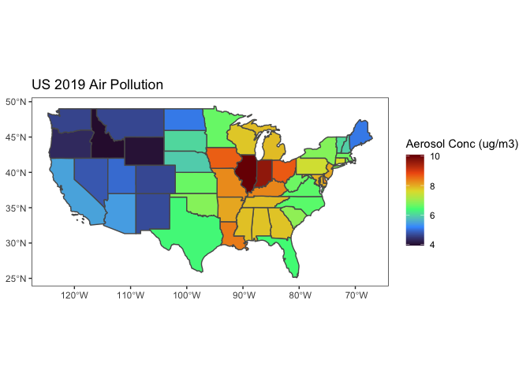

Intro to stars package geospatial analysis
================

For this project we will be investigating the surface-level aerosol data
that NASA makes publicly available. This time we will focus on 2019.
Aerosol data is from NASA, originally downloaded from the following
source:
<https://sedac.ciesin.columbia.edu/data/set/sdei-global-annual-gwr-pm2-5-modis-misr-seawifs-aod-v4-gl-03/data-download>

From the data set description: “The PM2.5 grids consist of
concentrations (micrograms per cubic meter) of all composition
ground-level fine particulate matter (PM2.5) per 0.01 degree grid cells
for each of the twenty-two years for the period 1998 to 2019.”

We will also be making use of US census data for a shape file that
provides the border of the United States. The files can be found here:
<https://www.census.gov/geographies/mapping-files/time-series/geo/carto-boundary-file.html>

Another method for obtaining US census shape files will be discussed
later, in which we make use of the Tigris package.

``` r
library(stars)
library(tidyverse)
library(ggpubr)
library(terra)
library(tigris)


aero <- read_stars('sdei-global-annual-gwr-pm2-5-modis-misr-seawifs-aod-v4-gl-03-2019.tif')
shp <- st_read("cb_2018_us_nation_5m.shp")
```

    ## Reading layer `cb_2018_us_nation_5m' from data source 
    ##   `/Users/drew/Documents/Employment:School paperwork/Tutoring work/Git Work/scholometrics/Geospatial/cb_2018_us_nation_5m.shp' 
    ##   using driver `ESRI Shapefile'
    ## Simple feature collection with 1 feature and 3 fields
    ## Geometry type: MULTIPOLYGON
    ## Dimension:     XY
    ## Bounding box:  xmin: -179.1473 ymin: -14.55255 xmax: 179.7785 ymax: 71.35256
    ## Geodetic CRS:  NAD83

``` r
#this is taking the shapefile for all US territories, and cutting it down to the eastern seaboard.
eastern_shp <- st_crop(shp, c(xmin=-83, xmax=-60, ymin=24, ymax=50))

plot(eastern_shp$geometry)
```

<!-- -->

``` r
#if we attempt to crop the raster file to our shapefile, we get the following error: "for cropping, the CRS of both objects has to be identical". To solve this, we need to set them to the same CRS (coordinate reference system). These are just different ways of doing map projections, and fixing this is simple.

st_crs(aero)
#the raster file is in the "WGS 84" CRS - which is the "World Geodetic System 1984"

st_crs(eastern_shp)
#the shape file is in the "NAD83" CRS - which is "North American Datum 1983"
```

``` r
#we will transform the shape file to have the same CRS as the 
eastern_shp <- st_transform(eastern_shp, crs = st_crs(aero))

#now for comparison, we can look at the difference between the two shape files (if any)
old_shp <- st_crop(shp, c(xmin=-83, xmax=-60, ymin=24, ymax=50))

old <- ggplot()+
  geom_sf(aes(geometry = eastern_shp$geometry))+
  theme_bw()
  
new <- ggplot()+
  geom_sf(aes(geometry = old_shp$geometry))+
  theme_bw()

ggarrange(old, new)
```

<!-- -->

``` r
#no apparent difference between the two plots, as these two projections must have treated this region in roughly the same way. 
```

Now to crop our global aerosol data just to the region that we are
interested in.

``` r
eastern_aerosols <- st_crop(aero, eastern_shp)
```

Plotting fine resolution raster data can be time consuming, and
downsampling is a way that we can mitigate that at the cost of
resolution. Next we will plot our data using different downsampling
options.

``` r
#leaving off the first two options as they take a very long time to run, however the code is here if you would like to see higher resolution options.

# start <- Sys.time()
# d0 <- ggplot()+
#   geom_stars(data = eastern_aerosols)+
#   geom_sf(data = eastern_shp, alpha = 0)+
#   scale_fill_viridis_c(option = "turbo", na.value = "transparent")+
#   labs(fill = "Air Particle Conc (ug/m3)")+
#   theme_void()+
#   theme(legend.position = "none")
# end <- Sys.time()
# ds0_time <- end - start
# 
# 
# start <- Sys.time()
# d1 <- ggplot()+
#   geom_stars(data = eastern_aerosols, downsample = 1)+
#   geom_sf(data = eastern_shp, alpha = 0)+
#   scale_fill_viridis_c(option = "turbo", na.value = "transparent")+
#   labs(fill = "Air Particle Conc (ug/m3)")+
#   theme_void()+
#   theme(legend.position = "none")
# end <- Sys.time()
# ds1_time <- end - start


start <- Sys.time()
d3 <- ggplot()+
  geom_stars(data = eastern_aerosols, downsample = 3)+
  geom_sf(data = eastern_shp, alpha = 0)+
  scale_fill_viridis_c(option = "turbo", na.value = "transparent")+
  labs(fill = "Air Particle Conc (ug/m3)")+
  theme_void()+
  theme(legend.position = "none")
end <- Sys.time()
ds3_time <- end - start


start <- Sys.time()
d7 <- ggplot()+
  geom_stars(data = eastern_aerosols, downsample = 7)+
  geom_sf(data = eastern_shp, alpha = 0)+
  scale_fill_viridis_c(option = "turbo", na.value = "transparent")+
  labs(fill = "Air Particle Conc (ug/m3)")+
  theme_void()+
  theme(legend.position = "none")
end <- Sys.time()
ds7_time <- end - start


start <- Sys.time()
d15 <- ggplot()+
  geom_stars(data = eastern_aerosols, downsample = 15)+
  geom_sf(data = eastern_shp, alpha = 0)+
  scale_fill_viridis_c(option = "turbo", na.value = "transparent")+
  labs(fill = "Air Particle Conc (ug/m3)")+
  theme_void()+
  theme(legend.position = 'none')
end <- Sys.time()
ds15_time <- end - start

#we could arrange these plots using ggarrange or plot.grid, however, for ease of seeing the full resolution I will plot them separately.
# ggarrange(d0, d1, d3, d7, d15, nrow = 1,  labels = c(round(ds0_time,2), round(ds1_time,2), round(ds3_time,2), round(ds7_time,2), round(ds15_time,2)))

# d0 + labs(title = paste("Time:",round(ds0_time, 2),"Seconds"))
# d1 + labs(title = paste("Time:",round(ds1_time, 2),"Seconds"))
d3 + labs(title = paste("Time:",round(ds3_time, 2),"Seconds"))
```

<!-- -->

``` r
d7 + labs(title = paste("Time:",round(ds7_time, 2),"Seconds"))
```

<!-- -->

``` r
d15 + labs(title = paste("Time:",round(ds15_time, 2),"Seconds"))
```

<!-- -->

The visual change in resolution is most apparent between 7 and 15. We
will use downsampling in the following section to vastly reduce the time
it takes to display larger maps.

From this image we can see that the region of the eastern United States
with the greatest aerosol pollution in 2019 was greatest around
southeastern Pennsylvania and New Jersey, as well as northern Ohio.

Now let’s compare the east coast to the entire USA. First we will crop
our vector shapefile to contain just the United States, and then we will
use that to crop our stars (raster) data to that region.

``` r
us_shp <- st_crop(shp, c(xmin=-125, xmax=-60, ymin=22, ymax=50))

#Plotting our shape file to ensure that it covers the entire continental US
plot(us_shp$geometry)
```

<!-- -->

``` r
us_shp <- st_transform(us_shp$geometry, crs = st_crs(aero))

us_aerosols <- st_crop(aero, us_shp)
```

``` r
doParallel::registerDoParallel()

ggplot()+
  geom_stars(data = us_aerosols, downsample = 14)+
  geom_sf(data = us_shp, alpha = 0)+
  scale_fill_viridis_c(option = "turbo", na.value = "transparent")+
  labs(fill = "Air Particle Conc (ug/m3)")+
  theme_void()
```

<!-- -->

We can see that the majority of aerosols over the United States are
concentrated within the middle of the country around Ohio, with a few
hotspots in the southwest and northeast. Now that we have identified the
areas with the greatest air pollution in 2019, it would be interesting
to determine what was driving that pollution.

The tigris library downloads shape files for many different US census
locations. Let’s take a closer look at the state of Michigan,
aggregating our aerosol data by county to identify the regions that are
the most polluted.

``` r
mi <- counties(state = "MI", cb = T, resolution = "20m") %>%
  st_transform(st_crs(aero))
```

    ##   |                                                                              |                                                                      |   0%  |                                                                              |                                                                      |   1%  |                                                                              |=                                                                     |   1%  |                                                                              |=                                                                     |   2%  |                                                                              |==                                                                    |   2%  |                                                                              |==                                                                    |   3%  |                                                                              |===                                                                   |   4%  |                                                                              |===                                                                   |   5%  |                                                                              |=======                                                               |   9%  |                                                                              |=======                                                               |  10%  |                                                                              |========                                                              |  11%  |                                                                              |========                                                              |  12%  |                                                                              |=========                                                             |  13%  |                                                                              |==========                                                            |  14%  |                                                                              |==========                                                            |  15%  |                                                                              |===========                                                           |  15%  |                                                                              |===========                                                           |  16%  |                                                                              |============                                                          |  17%  |                                                                              |============                                                          |  18%  |                                                                              |=============                                                         |  18%  |                                                                              |=============                                                         |  19%  |                                                                              |==============                                                        |  19%  |                                                                              |=================                                                     |  24%  |                                                                              |=================                                                     |  25%  |                                                                              |==================                                                    |  25%  |                                                                              |==================                                                    |  26%  |                                                                              |===================                                                   |  27%  |                                                                              |===================                                                   |  28%  |                                                                              |====================                                                  |  28%  |                                                                              |====================                                                  |  29%  |                                                                              |=====================                                                 |  29%  |                                                                              |=====================                                                 |  30%  |                                                                              |======================                                                |  31%  |                                                                              |======================                                                |  32%  |                                                                              |=======================                                               |  32%  |                                                                              |=======================                                               |  33%  |                                                                              |========================                                              |  34%  |                                                                              |========================                                              |  35%  |                                                                              |=========================                                             |  35%  |                                                                              |=========================                                             |  36%  |                                                                              |==========================                                            |  37%  |                                                                              |==========================                                            |  38%  |                                                                              |===========================                                           |  38%  |                                                                              |===========================                                           |  39%  |                                                                              |============================                                          |  39%  |                                                                              |============================                                          |  40%  |                                                                              |============================                                          |  41%  |                                                                              |=============================                                         |  41%  |                                                                              |=============================                                         |  42%  |                                                                              |==============================                                        |  43%  |                                                                              |===============================                                       |  44%  |                                                                              |===============================                                       |  45%  |                                                                              |================================                                      |  45%  |                                                                              |================================                                      |  46%  |                                                                              |=================================                                     |  47%  |                                                                              |=================================                                     |  48%  |                                                                              |==================================                                    |  48%  |                                                                              |==================================                                    |  49%  |                                                                              |===================================                                   |  49%  |                                                                              |===================================                                   |  50%  |                                                                              |===================================                                   |  51%  |                                                                              |====================================                                  |  51%  |                                                                              |====================================                                  |  52%  |                                                                              |=====================================                                 |  53%  |                                                                              |=====================================                                 |  54%  |                                                                              |======================================                                |  54%  |                                                                              |======================================                                |  55%  |                                                                              |=======================================                               |  55%  |                                                                              |=======================================                               |  56%  |                                                                              |========================================                              |  57%  |                                                                              |========================================                              |  58%  |                                                                              |=========================================                             |  58%  |                                                                              |=========================================                             |  59%  |                                                                              |==========================================                            |  59%  |                                                                              |==========================================                            |  60%  |                                                                              |===========================================                           |  61%  |                                                                              |===========================================                           |  62%  |                                                                              |============================================                          |  62%  |                                                                              |============================================                          |  63%  |                                                                              |=============================================                         |  64%  |                                                                              |=============================================                         |  65%  |                                                                              |==============================================                        |  65%  |                                                                              |==============================================                        |  66%  |                                                                              |===============================================                       |  67%  |                                                                              |===============================================                       |  68%  |                                                                              |================================================                      |  68%  |                                                                              |================================================                      |  69%  |                                                                              |=================================================                     |  70%  |                                                                              |=================================================                     |  71%  |                                                                              |==================================================                    |  71%  |                                                                              |==================================================                    |  72%  |                                                                              |===================================================                   |  73%  |                                                                              |====================================================                  |  74%  |                                                                              |====================================================                  |  75%  |                                                                              |=====================================================                 |  75%  |                                                                              |=====================================================                 |  76%  |                                                                              |======================================================                |  77%  |                                                                              |======================================================                |  78%  |                                                                              |=======================================================               |  78%  |                                                                              |=======================================================               |  79%  |                                                                              |========================================================              |  79%  |                                                                              |========================================================              |  80%  |                                                                              |=========================================================             |  81%  |                                                                              |=========================================================             |  82%  |                                                                              |==========================================================            |  82%  |                                                                              |==========================================================            |  83%  |                                                                              |===========================================================           |  84%  |                                                                              |===========================================================           |  85%  |                                                                              |============================================================          |  85%  |                                                                              |============================================================          |  86%  |                                                                              |=============================================================         |  87%  |                                                                              |=============================================================         |  88%  |                                                                              |==============================================================        |  88%  |                                                                              |==============================================================        |  89%  |                                                                              |===============================================================       |  89%  |                                                                              |===============================================================       |  90%  |                                                                              |================================================================      |  91%  |                                                                              |================================================================      |  92%  |                                                                              |=================================================================     |  93%  |                                                                              |==================================================================    |  94%  |                                                                              |==================================================================    |  95%  |                                                                              |===================================================================   |  95%  |                                                                              |===================================================================   |  96%  |                                                                              |====================================================================  |  97%  |                                                                              |====================================================================  |  98%  |                                                                              |===================================================================== |  98%  |                                                                              |===================================================================== |  99%  |                                                                              |======================================================================|  99%  |                                                                              |======================================================================| 100%

``` r
mi_agg <- aggregate(aero, by = mi$geometry, mean, na.rm = T)

mi %>%
  mutate(aerosols = mi_agg$`sdei-global-annual-gwr-pm2-5-modis-misr-seawifs-aod-v4-gl-03-2019.tif`) %>%
  ggplot()+
  geom_sf(aes(fill = aerosols))+
  scale_fill_viridis_c(option = 'turbo')+
  theme_bw()+
  theme(panel.grid.major = element_blank(), panel.grid.minor = element_blank())+
  labs(fill = "Aerosol Conc (ug/m3)", title = "Michigan 2019 Air Pollution")
```

<!-- -->

From this analysis it is clear that the pollution is concentrated in the
southeastern corner of the state, dissipating as you move north and
west. Wayne County - the county where Detroit is located - is the area
with the most pollution. And the air pollution from the city appears to
extend out for several counties.

Another question we might have is which states suffer from the greatest
levels of pollution. To investigate that, we can perform the same
aggregation, this time looking at each of the states.

``` r
us_state <- states(cb = T, resolution = "20m") %>%
  st_crop(c(xmin=-125, xmax=-60, ymin=22, ymax=50)) %>%
  st_transform(st_crs(aero))
```

    ##   |                                                                              |                                                                      |   0%  |                                                                              |=                                                                     |   2%  |                                                                              |===                                                                   |   4%  |                                                                              |=====                                                                 |   7%  |                                                                              |========                                                              |  11%  |                                                                              |==============                                                        |  20%  |                                                                              |==============================                                        |  43%  |                                                                              |================================                                      |  45%  |                                                                              |=================================                                     |  47%  |                                                                              |===================================                                   |  50%  |                                                                              |====================================                                  |  52%  |                                                                              |======================================                                |  54%  |                                                                              |========================================                              |  56%  |                                                                              |===========================================                           |  61%  |                                                                              |============================================                          |  63%  |                                                                              |==============================================                        |  65%  |                                                                              |===============================================                       |  68%  |                                                                              |=================================================                     |  70%  |                                                                              |===================================================                   |  72%  |                                                                              |====================================================                  |  75%  |                                                                              |======================================================                |  77%  |                                                                              |=======================================================               |  79%  |                                                                              |=========================================================             |  81%  |                                                                              |===========================================================           |  84%  |                                                                              |============================================================          |  86%  |                                                                              |==============================================================        |  88%  |                                                                              |===============================================================       |  90%  |                                                                              |=================================================================     |  93%  |                                                                              |==================================================================    |  95%  |                                                                              |====================================================================  |  97%  |                                                                              |======================================================================|  99%  |                                                                              |======================================================================| 100%

``` r
#Now I will be downsampling our stars object to a lower resolution, which makes it a lot faster to aggregate over.
aero_ds <- st_downsample(aero, 15)

us_agg <- aggregate(aero_ds, by = us_state$geometry, mean, na.rm = T)

us_state %>%
  mutate(aerosols = us_agg$`sdei-global-annual-gwr-pm2-5-modis-misr-seawifs-aod-v4-gl-03-2019.tif`) %>%
  ggplot()+
  geom_sf(aes(fill = aerosols))+
  scale_fill_viridis_c(option = 'turbo')+
  theme_bw()+
  theme(panel.grid.major = element_blank(), panel.grid.minor = element_blank())+
  labs(fill = "Aerosol Conc (ug/m3)", title = "US 2019 Air Pollution")
```

<!-- -->

From here we can see that the most polluted state on average is
Illinois. Let’s do one more investigation on a state level, looking at
several states now instead of just one. This region is called the “East
North Central Division”.

Again we can use the Tigris package.

``` r
polluted_st <- counties(state = c("OH", "MI", "IL", "IN", "WI"), cb = T, resolution = "5m") %>%
  st_transform(st_crs(aero_ds))
```

    ##   |                                                                              |                                                                      |   0%  |                                                                              |                                                                      |   1%  |                                                                              |=                                                                     |   1%  |                                                                              |=                                                                     |   2%  |                                                                              |==                                                                    |   2%  |                                                                              |==                                                                    |   3%  |                                                                              |===                                                                   |   4%  |                                                                              |===                                                                   |   5%  |                                                                              |====                                                                  |   5%  |                                                                              |====                                                                  |   6%  |                                                                              |=====                                                                 |   7%  |                                                                              |=====                                                                 |   8%  |                                                                              |======                                                                |   8%  |                                                                              |======                                                                |   9%  |                                                                              |=======                                                               |   9%  |                                                                              |=======                                                               |  10%  |                                                                              |=======                                                               |  11%  |                                                                              |========                                                              |  11%  |                                                                              |========                                                              |  12%  |                                                                              |=========                                                             |  12%  |                                                                              |=========                                                             |  13%  |                                                                              |==========                                                            |  14%  |                                                                              |==========                                                            |  15%  |                                                                              |===========                                                           |  15%  |                                                                              |===========                                                           |  16%  |                                                                              |============                                                          |  17%  |                                                                              |============                                                          |  18%  |                                                                              |=============                                                         |  18%  |                                                                              |=============                                                         |  19%  |                                                                              |==============                                                        |  19%  |                                                                              |==============                                                        |  20%  |                                                                              |==============                                                        |  21%  |                                                                              |===============                                                       |  21%  |                                                                              |===============                                                       |  22%  |                                                                              |================                                                      |  22%  |                                                                              |================                                                      |  23%  |                                                                              |=================                                                     |  24%  |                                                                              |=================                                                     |  25%  |                                                                              |==================                                                    |  25%  |                                                                              |==================                                                    |  26%  |                                                                              |===================                                                   |  26%  |                                                                              |===================                                                   |  27%  |                                                                              |===================                                                   |  28%  |                                                                              |====================                                                  |  28%  |                                                                              |====================                                                  |  29%  |                                                                              |=====================                                                 |  29%  |                                                                              |=====================                                                 |  30%  |                                                                              |=====================                                                 |  31%  |                                                                              |======================                                                |  31%  |                                                                              |======================                                                |  32%  |                                                                              |=======================                                               |  32%  |                                                                              |=======================                                               |  33%  |                                                                              |========================                                              |  34%  |                                                                              |========================                                              |  35%  |                                                                              |=========================                                             |  35%  |                                                                              |=========================                                             |  36%  |                                                                              |==========================                                            |  36%  |                                                                              |==========================                                            |  37%  |                                                                              |==========================                                            |  38%  |                                                                              |===========================                                           |  38%  |                                                                              |===========================                                           |  39%  |                                                                              |============================                                          |  39%  |                                                                              |============================                                          |  40%  |                                                                              |============================                                          |  41%  |                                                                              |=============================                                         |  41%  |                                                                              |=============================                                         |  42%  |                                                                              |==============================                                        |  42%  |                                                                              |==============================                                        |  43%  |                                                                              |===============================                                       |  44%  |                                                                              |===============================                                       |  45%  |                                                                              |================================                                      |  45%  |                                                                              |================================                                      |  46%  |                                                                              |=================================                                     |  46%  |                                                                              |=================================                                     |  47%  |                                                                              |=================================                                     |  48%  |                                                                              |==================================                                    |  48%  |                                                                              |==================================                                    |  49%  |                                                                              |===================================                                   |  49%  |                                                                              |===================================                                   |  50%  |                                                                              |===================================                                   |  51%  |                                                                              |====================================                                  |  51%  |                                                                              |====================================                                  |  52%  |                                                                              |=====================================                                 |  52%  |                                                                              |=====================================                                 |  53%  |                                                                              |======================================                                |  54%  |                                                                              |======================================                                |  55%  |                                                                              |=======================================                               |  55%  |                                                                              |=======================================                               |  56%  |                                                                              |========================================                              |  56%  |                                                                              |========================================                              |  57%  |                                                                              |========================================                              |  58%  |                                                                              |=========================================                             |  58%  |                                                                              |=========================================                             |  59%  |                                                                              |==========================================                            |  59%  |                                                                              |==========================================                            |  60%  |                                                                              |==========================================                            |  61%  |                                                                              |===========================================                           |  61%  |                                                                              |===========================================                           |  62%  |                                                                              |============================================                          |  62%  |                                                                              |============================================                          |  63%  |                                                                              |=============================================                         |  64%  |                                                                              |=============================================                         |  65%  |                                                                              |==============================================                        |  65%  |                                                                              |==============================================                        |  66%  |                                                                              |===============================================                       |  66%  |                                                                              |===============================================                       |  67%  |                                                                              |===============================================                       |  68%  |                                                                              |================================================                      |  68%  |                                                                              |================================================                      |  69%  |                                                                              |=================================================                     |  69%  |                                                                              |=================================================                     |  70%  |                                                                              |=================================================                     |  71%  |                                                                              |==================================================                    |  71%  |                                                                              |==================================================                    |  72%  |                                                                              |===================================================                   |  72%  |                                                                              |===================================================                   |  73%  |                                                                              |====================================================                  |  74%  |                                                                              |====================================================                  |  75%  |                                                                              |=====================================================                 |  75%  |                                                                              |=====================================================                 |  76%  |                                                                              |======================================================                |  77%  |                                                                              |======================================================                |  78%  |                                                                              |=======================================================               |  78%  |                                                                              |=======================================================               |  79%  |                                                                              |========================================================              |  79%  |                                                                              |=========================================================             |  81%  |                                                                              |=========================================================             |  82%  |                                                                              |==========================================================            |  82%  |                                                                              |==========================================================            |  83%  |                                                                              |============================================================          |  85%  |                                                                              |============================================================          |  86%  |                                                                              |=============================================================         |  87%  |                                                                              |=============================================================         |  88%  |                                                                              |===============================================================       |  89%  |                                                                              |===============================================================       |  90%  |                                                                              |================================================================      |  91%  |                                                                              |================================================================      |  92%  |                                                                              |=================================================================     |  93%  |                                                                              |=================================================================     |  94%  |                                                                              |==================================================================    |  94%  |                                                                              |==================================================================    |  95%  |                                                                              |===================================================================   |  95%  |                                                                              |===================================================================   |  96%  |                                                                              |====================================================================  |  96%  |                                                                              |====================================================================  |  97%  |                                                                              |====================================================================  |  98%  |                                                                              |===================================================================== |  98%  |                                                                              |===================================================================== |  99%  |                                                                              |======================================================================|  99%  |                                                                              |======================================================================| 100%

``` r
polluted_agg <- aggregate(aero_ds, polluted_st, mean, na.rm = T)

polluted_st %>%
  mutate(aerosols = polluted_agg$`sdei-global-annual-gwr-pm2-5-modis-misr-seawifs-aod-v4-gl-03-2019.tif`) %>%
  ggplot()+
  geom_sf(aes(fill = aerosols))+
  scale_fill_viridis_c(option = 'turbo')+
  theme_bw()+
  theme(panel.grid.major = element_blank(), panel.grid.minor = element_blank())+
  labs(fill = "Aerosol Conc (ug/m3)", title = "East North Central Division 2019 Air Pollution")
```

<!-- -->

There are generally hotspots around city centers as we might expect,
with more pollution near Chicago and Detroit. There is one exception in
the southern portion of Indiana, which is not a metropolitan area.

Now that we have covered basic visualizations, downsampling, and
aggregation, in the next file we will move forward into interpolation
and modeling.
