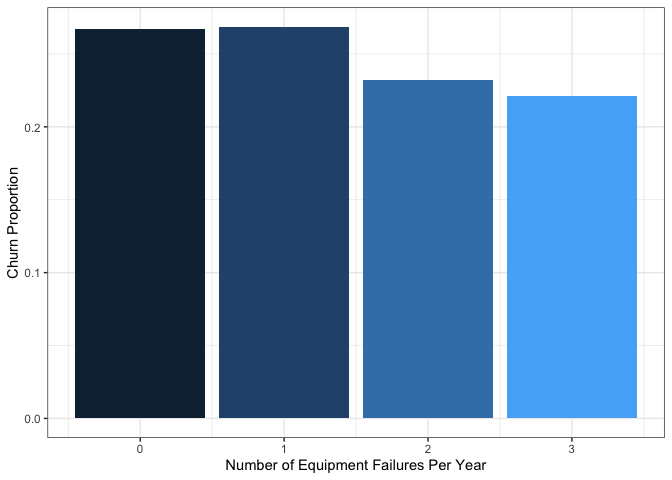
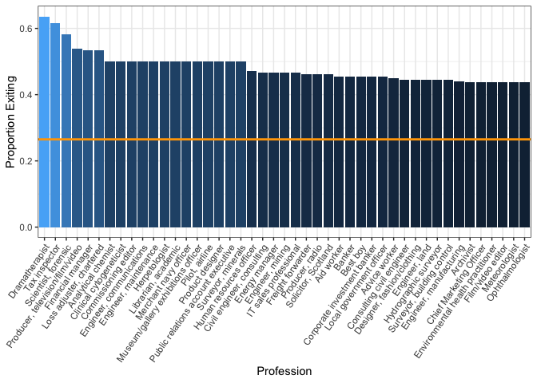
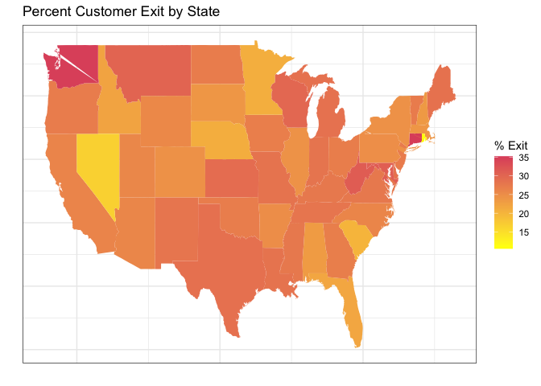

Customer churn predictions
================

``` r
library(readr)
library(tidyverse)
```

    ## ── Attaching packages ─────────────────────────────────────── tidyverse 1.3.1 ──

    ## ✓ ggplot2 3.3.5     ✓ dplyr   1.0.7
    ## ✓ tibble  3.1.6     ✓ stringr 1.4.0
    ## ✓ tidyr   1.1.4     ✓ forcats 0.5.1
    ## ✓ purrr   0.3.4

    ## ── Conflicts ────────────────────────────────────────── tidyverse_conflicts() ──
    ## x dplyr::filter() masks stats::filter()
    ## x dplyr::lag()    masks stats::lag()

``` r
library(tidymodels)
```

    ## Registered S3 method overwritten by 'tune':
    ##   method                   from   
    ##   required_pkgs.model_spec parsnip

    ## ── Attaching packages ────────────────────────────────────── tidymodels 0.1.4 ──

    ## ✓ broom        0.7.10     ✓ rsample      0.1.1 
    ## ✓ dials        0.0.10     ✓ tune         0.1.6 
    ## ✓ infer        1.0.0      ✓ workflows    0.2.4 
    ## ✓ modeldata    0.1.1      ✓ workflowsets 0.1.0 
    ## ✓ parsnip      0.1.7      ✓ yardstick    0.0.9 
    ## ✓ recipes      0.1.17

    ## ── Conflicts ───────────────────────────────────────── tidymodels_conflicts() ──
    ## x scales::discard() masks purrr::discard()
    ## x dplyr::filter()   masks stats::filter()
    ## x recipes::fixed()  masks stringr::fixed()
    ## x dplyr::lag()      masks stats::lag()
    ## x yardstick::spec() masks readr::spec()
    ## x recipes::step()   masks stats::step()
    ## • Use tidymodels_prefer() to resolve common conflicts.

``` r
library(skimr)

ch.df <- read_csv("churn_clean.csv")
```

    ## Rows: 10000 Columns: 50

    ## ── Column specification ────────────────────────────────────────────────────────
    ## Delimiter: ","
    ## chr (27): Customer_id, Interaction, UID, City, State, County, Area, TimeZone...
    ## dbl (23): CaseOrder, Zip, Lat, Lng, Population, Children, Age, Income, Outag...

    ## 
    ## ℹ Use `spec()` to retrieve the full column specification for this data.
    ## ℹ Specify the column types or set `show_col_types = FALSE` to quiet this message.

``` r
View(ch.df)
```

The goal of this project will ultimately be to predict customer churn
for a telephone company from various predictive variables. First to do
some exploratory data analysis.

``` r
ch.df %>% skim
```

|                                                  |            |
|:-------------------------------------------------|:-----------|
| Name                                             | Piped data |
| Number of rows                                   | 10000      |
| Number of columns                                | 50         |
| \_\_\_\_\_\_\_\_\_\_\_\_\_\_\_\_\_\_\_\_\_\_\_   |            |
| Column type frequency:                           |            |
| character                                        | 27         |
| numeric                                          | 23         |
| \_\_\_\_\_\_\_\_\_\_\_\_\_\_\_\_\_\_\_\_\_\_\_\_ |            |
| Group variables                                  | None       |

Data summary

**Variable type: character**

| skim\_variable   | n\_missing | complete\_rate | min | max | empty | n\_unique | whitespace |
|:-----------------|-----------:|---------------:|----:|----:|------:|----------:|-----------:|
| Customer\_id     |          0 |              1 |   6 |   7 |     0 |     10000 |          0 |
| Interaction      |          0 |              1 |  36 |  36 |     0 |     10000 |          0 |
| UID              |          0 |              1 |  32 |  32 |     0 |     10000 |          0 |
| City             |          0 |              1 |   3 |  26 |     0 |      6058 |          0 |
| State            |          0 |              1 |   2 |   2 |     0 |        52 |          0 |
| County           |          0 |              1 |   3 |  21 |     0 |      1620 |          0 |
| Area             |          0 |              1 |   5 |   8 |     0 |         3 |          0 |
| TimeZone         |          0 |              1 |  12 |  30 |     0 |        25 |          0 |
| Job              |          0 |              1 |   3 |  59 |     0 |       639 |          0 |
| Marital          |          0 |              1 |   7 |  13 |     0 |         5 |          0 |
| Gender           |          0 |              1 |   4 |   9 |     0 |         3 |          0 |
| Churn            |          0 |              1 |   2 |   3 |     0 |         2 |          0 |
| Techie           |          0 |              1 |   2 |   3 |     0 |         2 |          0 |
| Contract         |          0 |              1 |   8 |  14 |     0 |         3 |          0 |
| Port\_modem      |          0 |              1 |   2 |   3 |     0 |         2 |          0 |
| Tablet           |          0 |              1 |   2 |   3 |     0 |         2 |          0 |
| InternetService  |          0 |              1 |   3 |  11 |     0 |         3 |          0 |
| Phone            |          0 |              1 |   2 |   3 |     0 |         2 |          0 |
| Multiple         |          0 |              1 |   2 |   3 |     0 |         2 |          0 |
| OnlineSecurity   |          0 |              1 |   2 |   3 |     0 |         2 |          0 |
| OnlineBackup     |          0 |              1 |   2 |   3 |     0 |         2 |          0 |
| DeviceProtection |          0 |              1 |   2 |   3 |     0 |         2 |          0 |
| TechSupport      |          0 |              1 |   2 |   3 |     0 |         2 |          0 |
| StreamingTV      |          0 |              1 |   2 |   3 |     0 |         2 |          0 |
| StreamingMovies  |          0 |              1 |   2 |   3 |     0 |         2 |          0 |
| PaperlessBilling |          0 |              1 |   2 |   3 |     0 |         2 |          0 |
| PaymentMethod    |          0 |              1 |  12 |  24 |     0 |         4 |          0 |

**Variable type: numeric**

| skim\_variable         | n\_missing | complete\_rate |     mean |       sd |      p0 |      p25 |      p50 |      p75 |      p100 | hist  |
|:-----------------------|-----------:|---------------:|---------:|---------:|--------:|---------:|---------:|---------:|----------:|:------|
| CaseOrder              |          0 |              1 |  5000.50 |  2886.90 |    1.00 |  2500.75 |  5000.50 |  7500.25 |  10000.00 | ▇▇▇▇▇ |
| Zip                    |          0 |              1 | 49153.32 | 27532.20 |  601.00 | 26292.50 | 48869.50 | 71866.50 |  99929.00 | ▇▇▇▇▆ |
| Lat                    |          0 |              1 |    38.76 |     5.44 |   17.97 |    35.34 |    39.40 |    42.11 |     70.64 | ▁▇▇▁▁ |
| Lng                    |          0 |              1 |   -90.78 |    15.16 | -171.69 |   -97.08 |   -87.92 |   -80.09 |    -65.67 | ▁▁▂▆▇ |
| Population             |          0 |              1 |  9756.56 | 14432.70 |    0.00 |   738.00 |  2910.50 | 13168.00 | 111850.00 | ▇▁▁▁▁ |
| Children               |          0 |              1 |     2.09 |     2.15 |    0.00 |     0.00 |     1.00 |     3.00 |     10.00 | ▇▃▁▁▁ |
| Age                    |          0 |              1 |    53.08 |    20.70 |   18.00 |    35.00 |    53.00 |    71.00 |     89.00 | ▇▇▇▇▇ |
| Income                 |          0 |              1 | 39806.93 | 28199.92 |  348.67 | 19224.72 | 33170.60 | 53246.17 | 258900.70 | ▇▂▁▁▁ |
| Outage\_sec\_perweek   |          0 |              1 |    10.00 |     2.98 |    0.10 |     8.02 |    10.02 |    11.97 |     21.21 | ▁▅▇▂▁ |
| Email                  |          0 |              1 |    12.02 |     3.03 |    1.00 |    10.00 |    12.00 |    14.00 |     23.00 | ▁▂▇▂▁ |
| Contacts               |          0 |              1 |     0.99 |     0.99 |    0.00 |     0.00 |     1.00 |     2.00 |      7.00 | ▇▂▁▁▁ |
| Yearly\_equip\_failure |          0 |              1 |     0.40 |     0.64 |    0.00 |     0.00 |     0.00 |     1.00 |      6.00 | ▇▁▁▁▁ |
| Tenure                 |          0 |              1 |    34.53 |    26.44 |    1.00 |     7.92 |    35.43 |    61.48 |     72.00 | ▇▂▁▃▆ |
| MonthlyCharge          |          0 |              1 |   172.62 |    42.94 |   79.98 |   139.98 |   167.48 |   200.73 |    290.16 | ▂▇▆▃▁ |
| Bandwidth\_GB\_Year    |          0 |              1 |  3392.34 |  2185.29 |  155.51 |  1236.47 |  3279.54 |  5586.14 |   7158.98 | ▇▃▁▆▅ |
| Item1                  |          0 |              1 |     3.49 |     1.04 |    1.00 |     3.00 |     3.00 |     4.00 |      7.00 | ▃▇▇▃▁ |
| Item2                  |          0 |              1 |     3.51 |     1.03 |    1.00 |     3.00 |     4.00 |     4.00 |      7.00 | ▃▇▇▃▁ |
| Item3                  |          0 |              1 |     3.49 |     1.03 |    1.00 |     3.00 |     3.00 |     4.00 |      8.00 | ▃▆▇▁▁ |
| Item4                  |          0 |              1 |     3.50 |     1.03 |    1.00 |     3.00 |     3.00 |     4.00 |      7.00 | ▃▇▇▃▁ |
| Item5                  |          0 |              1 |     3.49 |     1.02 |    1.00 |     3.00 |     3.00 |     4.00 |      7.00 | ▃▇▇▃▁ |
| Item6                  |          0 |              1 |     3.50 |     1.03 |    1.00 |     3.00 |     3.00 |     4.00 |      8.00 | ▃▆▇▁▁ |
| Item7                  |          0 |              1 |     3.51 |     1.03 |    1.00 |     3.00 |     4.00 |     4.00 |      7.00 | ▃▇▇▃▁ |
| Item8                  |          0 |              1 |     3.50 |     1.03 |    1.00 |     3.00 |     3.00 |     4.00 |      8.00 | ▃▆▇▁▁ |

``` r
#it would be nice to turn our churn variable into a binary or logical instead of a factor with "Yes" and "No" categories, so I will do that below.

ch.df <- ch.df %>%
  mutate(Churn = ifelse(Churn == "Yes", 1, 0))
```

There are 10000 rows of data and 49 independent variables, with a fairly
even mix of categorical and numerical and it appears that cleaning has
already been handled in this case. Let’s do some basic plotting to
investigate some of our predictors.

It would make sense for there to be a higher churning proportion among
those who experience more equipment failures. Let’s investigate that.
Taking the mean of a binary variable gives the proportion of 1’s
(proportion of churn in this case). There is also a lack of data for 4
and 6 equipment failures so we will filter those groups out.

``` r
#this code first selects just the yearly equipment failure and churn columns, filters for 3 failures or fewer, and then takes the proportion of customers who leave (proportion of churn). The ggplot portion then generates the plot.

ch.df %>%
  select(Yearly_equip_failure, Churn)%>%
  filter(Yearly_equip_failure <= 3)%>%
  group_by(Yearly_equip_failure)%>%
  summarise(prop_churn = mean(Churn))%>%
  ggplot(aes(x = Yearly_equip_failure, y = prop_churn, fill = Yearly_equip_failure))+
  geom_col()+
  theme_bw()+
  theme(legend.position = 'none')+
  labs(x = "Number of Equipment Failures", y = "Churn Rate")
```

<!-- -->

``` r
#somewhat paradoxically we see a decline in churn rate with increased equipment failures, this could mean any number of things, possibly those customers are just the ones that report failures and the customers who do not simply leave. In either case the difference is small. 
```

Let’s now check the top 20 states for customer churn

``` r
ch.df %>% 
  select(State, Churn) %>%
  group_by(State) %>%
  summarise(prop = mean(Churn)) %>%
  arrange(desc(prop))%>%
  filter(prop >= .2772)%>%
  ggplot(aes(fill = reorder(State, -prop), y = prop, x = reorder(State, -prop)))+
  theme_bw()+
  theme(legend.position = "none")+
  geom_col()+
  labs(x='State or District', y="Proportion of Churn")
```

<!-- -->

This shows that DC has exceptionally high customer churn (with a sample
size of 14, which isn’t too small for this dataset), with CT and
Washington coming in second with a bit of a notable bump over the
following states. We could also break it down further by city, looking
at cities in CT and WA.

``` r
ch.df %>% 
  filter(State == "WA" | State == "CT") %>%
  select(City, Churn) %>% 
  group_by(City) %>%
  #filtering cities with fewer than 4 samples
  filter(n()>3) %>%
  summarise(prop = mean(Churn)) %>%
  arrange(desc(prop))%>%
  ggplot(aes(fill = reorder(City, -prop), y = prop, x = reorder(City, -prop)))+
  theme_bw()+
  theme(legend.position = "none")+
  geom_col()+
  labs(x='City (WA and CT)', y="Proportion of Churn")
```

<!-- -->

Getting this granular is somewhat hard considering there aren’t many
samples from each of these cities, however in a big-data scenario with
hundreds of samples for each city this approach would work well, and
would suggest issues with branches in those locations.
