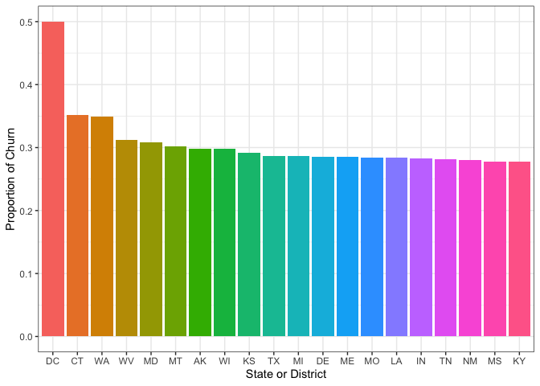
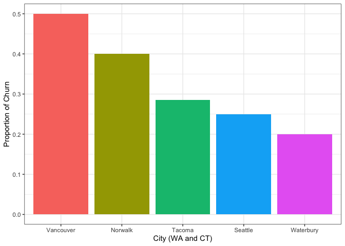

Customer Churn Visualizations
================

``` r
library(tidyverse)
library(skimr)

ch.df <- read_csv("churn_clean.csv")
```

The goal of this project will ultimately be to predict customer churn
for a telephone company from various predictive variables. In this first
file, we will do some exploratory data analytics and data visualization.

``` r
ch.df %>% skim
```

|                                                  |            |
|:-------------------------------------------------|:-----------|
| Name                                             | Piped data |
| Number of rows                                   | 10000      |
| Number of columns                                | 50         |
| \_\_\_\_\_\_\_\_\_\_\_\_\_\_\_\_\_\_\_\_\_\_\_   |            |
| Column type frequency:                           |            |
| character                                        | 27         |
| numeric                                          | 23         |
| \_\_\_\_\_\_\_\_\_\_\_\_\_\_\_\_\_\_\_\_\_\_\_\_ |            |
| Group variables                                  | None       |

Data summary

**Variable type: character**

| skim\_variable   | n\_missing | complete\_rate | min | max | empty | n\_unique | whitespace |
|:-----------------|-----------:|---------------:|----:|----:|------:|----------:|-----------:|
| Customer\_id     |          0 |              1 |   6 |   7 |     0 |     10000 |          0 |
| Interaction      |          0 |              1 |  36 |  36 |     0 |     10000 |          0 |
| UID              |          0 |              1 |  32 |  32 |     0 |     10000 |          0 |
| City             |          0 |              1 |   3 |  26 |     0 |      6058 |          0 |
| State            |          0 |              1 |   2 |   2 |     0 |        52 |          0 |
| County           |          0 |              1 |   3 |  21 |     0 |      1620 |          0 |
| Area             |          0 |              1 |   5 |   8 |     0 |         3 |          0 |
| TimeZone         |          0 |              1 |  12 |  30 |     0 |        25 |          0 |
| Job              |          0 |              1 |   3 |  59 |     0 |       639 |          0 |
| Marital          |          0 |              1 |   7 |  13 |     0 |         5 |          0 |
| Gender           |          0 |              1 |   4 |   9 |     0 |         3 |          0 |
| Churn            |          0 |              1 |   2 |   3 |     0 |         2 |          0 |
| Techie           |          0 |              1 |   2 |   3 |     0 |         2 |          0 |
| Contract         |          0 |              1 |   8 |  14 |     0 |         3 |          0 |
| Port\_modem      |          0 |              1 |   2 |   3 |     0 |         2 |          0 |
| Tablet           |          0 |              1 |   2 |   3 |     0 |         2 |          0 |
| InternetService  |          0 |              1 |   3 |  11 |     0 |         3 |          0 |
| Phone            |          0 |              1 |   2 |   3 |     0 |         2 |          0 |
| Multiple         |          0 |              1 |   2 |   3 |     0 |         2 |          0 |
| OnlineSecurity   |          0 |              1 |   2 |   3 |     0 |         2 |          0 |
| OnlineBackup     |          0 |              1 |   2 |   3 |     0 |         2 |          0 |
| DeviceProtection |          0 |              1 |   2 |   3 |     0 |         2 |          0 |
| TechSupport      |          0 |              1 |   2 |   3 |     0 |         2 |          0 |
| StreamingTV      |          0 |              1 |   2 |   3 |     0 |         2 |          0 |
| StreamingMovies  |          0 |              1 |   2 |   3 |     0 |         2 |          0 |
| PaperlessBilling |          0 |              1 |   2 |   3 |     0 |         2 |          0 |
| PaymentMethod    |          0 |              1 |  12 |  24 |     0 |         4 |          0 |

**Variable type: numeric**

| skim\_variable         | n\_missing | complete\_rate |     mean |       sd |      p0 |      p25 |      p50 |      p75 |      p100 | hist  |
|:-----------------------|-----------:|---------------:|---------:|---------:|--------:|---------:|---------:|---------:|----------:|:------|
| CaseOrder              |          0 |              1 |  5000.50 |  2886.90 |    1.00 |  2500.75 |  5000.50 |  7500.25 |  10000.00 | ▇▇▇▇▇ |
| Zip                    |          0 |              1 | 49153.32 | 27532.20 |  601.00 | 26292.50 | 48869.50 | 71866.50 |  99929.00 | ▇▇▇▇▆ |
| Lat                    |          0 |              1 |    38.76 |     5.44 |   17.97 |    35.34 |    39.40 |    42.11 |     70.64 | ▁▇▇▁▁ |
| Lng                    |          0 |              1 |   -90.78 |    15.16 | -171.69 |   -97.08 |   -87.92 |   -80.09 |    -65.67 | ▁▁▂▆▇ |
| Population             |          0 |              1 |  9756.56 | 14432.70 |    0.00 |   738.00 |  2910.50 | 13168.00 | 111850.00 | ▇▁▁▁▁ |
| Children               |          0 |              1 |     2.09 |     2.15 |    0.00 |     0.00 |     1.00 |     3.00 |     10.00 | ▇▃▁▁▁ |
| Age                    |          0 |              1 |    53.08 |    20.70 |   18.00 |    35.00 |    53.00 |    71.00 |     89.00 | ▇▇▇▇▇ |
| Income                 |          0 |              1 | 39806.93 | 28199.92 |  348.67 | 19224.72 | 33170.60 | 53246.17 | 258900.70 | ▇▂▁▁▁ |
| Outage\_sec\_perweek   |          0 |              1 |    10.00 |     2.98 |    0.10 |     8.02 |    10.02 |    11.97 |     21.21 | ▁▅▇▂▁ |
| Email                  |          0 |              1 |    12.02 |     3.03 |    1.00 |    10.00 |    12.00 |    14.00 |     23.00 | ▁▂▇▂▁ |
| Contacts               |          0 |              1 |     0.99 |     0.99 |    0.00 |     0.00 |     1.00 |     2.00 |      7.00 | ▇▂▁▁▁ |
| Yearly\_equip\_failure |          0 |              1 |     0.40 |     0.64 |    0.00 |     0.00 |     0.00 |     1.00 |      6.00 | ▇▁▁▁▁ |
| Tenure                 |          0 |              1 |    34.53 |    26.44 |    1.00 |     7.92 |    35.43 |    61.48 |     72.00 | ▇▂▁▃▆ |
| MonthlyCharge          |          0 |              1 |   172.62 |    42.94 |   79.98 |   139.98 |   167.48 |   200.73 |    290.16 | ▂▇▆▃▁ |
| Bandwidth\_GB\_Year    |          0 |              1 |  3392.34 |  2185.29 |  155.51 |  1236.47 |  3279.54 |  5586.14 |   7158.98 | ▇▃▁▆▅ |
| Item1                  |          0 |              1 |     3.49 |     1.04 |    1.00 |     3.00 |     3.00 |     4.00 |      7.00 | ▃▇▇▃▁ |
| Item2                  |          0 |              1 |     3.51 |     1.03 |    1.00 |     3.00 |     4.00 |     4.00 |      7.00 | ▃▇▇▃▁ |
| Item3                  |          0 |              1 |     3.49 |     1.03 |    1.00 |     3.00 |     3.00 |     4.00 |      8.00 | ▃▆▇▁▁ |
| Item4                  |          0 |              1 |     3.50 |     1.03 |    1.00 |     3.00 |     3.00 |     4.00 |      7.00 | ▃▇▇▃▁ |
| Item5                  |          0 |              1 |     3.49 |     1.02 |    1.00 |     3.00 |     3.00 |     4.00 |      7.00 | ▃▇▇▃▁ |
| Item6                  |          0 |              1 |     3.50 |     1.03 |    1.00 |     3.00 |     3.00 |     4.00 |      8.00 | ▃▆▇▁▁ |
| Item7                  |          0 |              1 |     3.51 |     1.03 |    1.00 |     3.00 |     4.00 |     4.00 |      7.00 | ▃▇▇▃▁ |
| Item8                  |          0 |              1 |     3.50 |     1.03 |    1.00 |     3.00 |     3.00 |     4.00 |      8.00 | ▃▆▇▁▁ |

``` r
#it would be nice to turn our churn variable into a binary or logical instead of a factor with "Yes" and "No" categories, so I will do that below.

ch.df <- ch.df %>%
  mutate(Churn = as.integer(ifelse(Churn == "Yes", 1, 0)))
```

There are 10000 rows of data and 49 independent variables, with a fairly
even mix of categorical and numerical and it appears that cleaning has
already been handled in this case. Let’s do some basic plotting to
investigate some of our predictors.

It would make sense for there to be a higher churning proportion among
those who experience more equipment failures. Let’s investigate that.
Taking the mean of a binary variable gives the proportion of 1’s
(proportion of churn in this case). There is also a lack of data for 4,
5, and 6 equipment failures so we will filter those groups out.

``` r
#this code first selects just the yearly equipment failure and churn columns, filters for 3 failures or fewer, and then takes the proportion of customers who leave (proportion of churn). The ggplot portion then generates the plot.

ch.df %>%
  select(Yearly_equip_failure, Churn)%>%
  filter(Yearly_equip_failure <= 3)%>%
  group_by(Yearly_equip_failure)%>%
  summarise(prop_churn = mean(Churn))%>%
  ggplot(aes(x = Yearly_equip_failure, y = prop_churn, fill = Yearly_equip_failure))+
  geom_col()+
  theme_bw()+
  theme(legend.position = 'none')+
  labs(x = "Number of Equipment Failures Per Year", y = "Churn Proportion")
```

<!-- -->

Somewhat paradoxically, we see a decline in churn rate with increased
equipment failures, this could mean any number of things, possibly those
customers are just the ones that report failures and the customers who
do not simply leave. In either case the difference is small.

Next, let’s check if there is any difference in churn rate by job.

``` r
ch.df %>%
  select(Job, Churn)%>%
  group_by(Job)%>%
  filter(n()>10)%>%
  summarise(prop_churn = mean(Churn), count = n())%>%
  arrange(desc(prop_churn))%>%
  filter(prop_churn >= prop_churn[40])%>%
  ggplot(aes(x = reorder(Job, -prop_churn), y = prop_churn, fill = prop_churn))+
  geom_col()+
  geom_hline(yintercept = mean(ch.df$Churn), color = 'orange', size = 1)+
  theme_bw()+
  theme(legend.position = 'none', axis.text.x = element_text(angle = 55, vjust = 1, hjust=1))+
  labs(x = "Profession", y = "Proportion Exiting")
```

<!-- -->

This plot shows the proportion of individuals who left our company for
each job for the 40 jobs with the highest churn, ordered by churn rate.
Notably any jobs with fewer than 11 samples were dropped, so somehow we
have more than 10 dramatherapists in our data set and they are not
particularly happy with our product. The orange line represents the
overall population churn rate, so all of these jobs are associated with
significantly higher than average churn.

Let’s now check the top 20 states for customer churn.

``` r
ch.df %>% 
  select(State, Churn) %>%
  group_by(State) %>%
  summarise(prop = mean(Churn), num = n()) %>%
  arrange(desc(prop))%>%
  filter(prop >= prop[20])%>%
  ggplot(aes(fill = reorder(State, -prop), y = prop, x = reorder(State, -prop)))+
  theme_bw()+
  theme(legend.position = "none")+
  geom_col()+
  labs(x='State or District', y="Proportion of Churn")
```

<!-- -->

This shows that DC has exceptionally high customer churn (with a sample
size of 14), with CT and Washington coming in second with a bit of a
notable bump over the following states.

Because this data has a geographical distribution, it may be nice to
look at a map. Next we will generate a map of customer churn rates, this
time ignoring DC due to its relatively low sample size and special
status as a district rather than a state.

``` r
#We can pull latitude and longitude data for state polygons using the "map_data" function from ggplot2
mapdata <- map_data("state")

#R also comes with some built-in data, one of which is the state names and abbreviations, we will generate a dataframe from two of these vectors.
states <- data.frame(region = tolower(state.name),state = state.abb)

#This may be somewhat complicated, so I recommend running in batches of lines. The pipe function is being used a lot here, which "pushes" the contents of the previous line into the first input position of the following function. 

ch.df %>% 
  select(State, Churn) %>%
#The three lines below group the data by state and then find the mean churn (% churn) by state, removing DC
  group_by(State) %>%
  summarise(prop = mean(Churn)*100) %>%
  filter(State != "DC") %>%
#the next two lines join our state positional data together with the main churning dataset, ultimately making use of the state abbreviations.
  left_join(states, by = c("State" = "state"))%>%
  left_join(mapdata, by = "region" ) %>%
#next we plot the data
  ggplot(aes(x = long, y = lat, group = region))+
  geom_polygon(aes(fill = prop))+
#everything below this point is just changing the plot aesthetically. Choosing pretty colors, making the background look prettier, changing labels, and removing ticks from the x and y axes. 
  scale_fill_gradient(low = "yellow", high = palette()[2])+
  labs(x= "", y = "", fill = "% Exit", title = "Percent Customer Exit by State")+
  theme_void()+
  theme(axis.ticks.x = element_blank(), axis.text.x = element_blank(), axis.text.y = element_blank(), axis.ticks.y = element_blank())
```

<!-- -->

Connecticut and Washington have particulaly high rates of customer
churn, so it may be interesting to look at cities in these states more
closely.

``` r
ch.df %>% 
  filter(State == "WA" | State == "CT") %>%
  select(City, Churn) %>% 
  group_by(City) %>%
  #filtering cities with fewer than 4 samples
  filter(n()>3) %>%
  summarise(prop = mean(Churn)) %>%
  arrange(desc(prop))%>%
  ggplot(aes(fill = reorder(City, -prop), y = prop, x = reorder(City, -prop)))+
  theme_bw()+
  theme(legend.position = "none")+
  geom_col()+
  labs(x='City (WA and CT)', y="Proportion of Churn")
```

<!-- -->

Getting this granular isn’t really effective here, considering there
aren’t many samples from each of these cities. However, in a big-data
scenario with hundreds of samples for each city this approach would work
well and could suggest issues with branches in those locations that
could be resolved to improve customer retention.

Next, it would be nice to look at how outage times impact customer
retention. I will round the outage times to the nearest tenth of a
second.

``` r
ch.df <- ch.df %>%
  mutate(rounded_outage = round(Outage_sec_perweek, 1))


ch.df %>%
  select(rounded_outage, Churn) %>%
  group_by(rounded_outage) %>%
  #filtering so we have at least 11 samples we are taking our proportions from
  filter(n() > 10) %>%
  summarise(prop_churn = mean(Churn)) %>%
  ggplot(aes(y = prop_churn, x = rounded_outage))+ 
  geom_line()+
  geom_point()+
  geom_smooth(method = 'lm')+
  theme_bw()+
  labs(x= "Seconds of Outage Per Week", y = 'Proportion of Churn')
```

    ## `geom_smooth()` using formula 'y ~ x'

<!-- --> It’s
arguable if there really is an effect here. It seems like churn rate
might slightly increase with more hours of outage, however I can get
different relationships if I change the assumptions. For example, by
binning to the hundredth of a second, or binning by the second. For now
it looks as though there may be a slight positive correlation.

\#Pie Chart

We could also make a pie chart for churn rate by gender. Pie charts are
tricky in ggplot, and require that you first create a bar plot and then
make use of polar coordinates.

``` r
ch.df %>%
#The following three lines take the Gender and Churn columns, and then find the proportion of customers who exit and the proportion retained.
  select(Gender, Churn) %>%
  group_by(Gender) %>%
  summarize(Exited = mean(Churn), Retained = 1-mean(Churn)) %>%
#Next we pivot longer in order to pull the exited and retained columns into one column, allowing for later facet wrapping. 
  pivot_longer(cols = c("Exited", "Retained")) %>%
#Now we initialize the plot, piping the transformed data into a ggplot object
  ggplot( aes(x = "", y = value, fill = name))+
#the following four lines create the plot, using stat = "identity" forces it to take the values directly from the dataset, and then coord_polar transforms the barplot into a pie chart. Theme_void gets rid of a lot of meaningless additional information, and then we remove the label for the legend as the labels are sufficient. 
  geom_bar(stat = "identity")+
  coord_polar("y", start = 0)+
  theme_void()+
  labs(fill = "")+
#Facet wrapping by Gender breaks this into 3 pie charts, one for each gender identity. 
  facet_wrap(~Gender)
```

<!-- -->

It appears that men are more likely than women or nonbinary individuals.
If we want to know by exactly how much we can calculate it.

``` r
m_churn <- ch.df %>%
  select(Gender, Churn) %>%
  mutate(Gender = ifelse(Gender == "Male", "Male", "Female/Nonbinary"))%>%
  group_by(Gender) %>%
  summarize(Exited = mean(Churn))

#the relative % difference between men and women/nonbinary for churn
(m_churn[[2,2]]/m_churn[[1,2]] - 1)*100
```

    ## [1] 9.793699

``` r
#the absolute % difference between men an women/nonbinary for churn
(m_churn[[2,2]]-m_churn[[1,2]]) * 100
```

    ## [1] 2.480101

So men are on average \~9.8% more likely to leave the company than women
or nonbinary individuals, with an absolute difference of 2.48% more
churn among men. It could be that our company is not appealing to men as
much as it is to women or nonbinary people, however this could also lack
statistical significance. To check this we can run a simple statistical
test, the chi square test.

``` r
chisq_data <- ch.df %>%
  select(Gender, Churn) %>%
  mutate(Gender = ifelse(Gender == "Male", "Male", "Female/Nonbinary"))

#the chisq.test function expects factors for x and y, but can recognize that there are only two values for y, and therefore treats it as a factor despite it being coded as numerical data.
chisq.test(x = chisq_data$Gender, y = chisq_data$Churn)
```

    ## 
    ##  Pearson's Chi-squared test with Yates' continuity correction
    ## 
    ## data:  chisq_data$Gender and chisq_data$Churn
    ## X-squared = 7.7474, df = 1, p-value = 0.005379

The p value is .005379 and therefore we can say that there is a
significant difference in churn rate between men and women/nonbinary
individuals at an alpha of .05. In proper statistical speak: we reject
the null hypothesis that there is no relationship between churn and
gender.

Now that we have done some visualization and identified a few
interesting relationships, it would be a good idea to do some modeling.
This will be performed in the SMOTE with GLM file.
